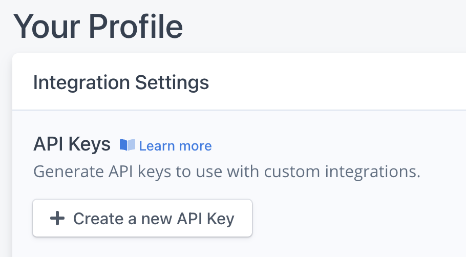

# Emerge upload action

Action to upload your build directly to Emerge for analysis.

## Usage

The Emerge upload action should be run on any event that should trigger a size analysis. Examples of this are:

- When pushing to specific branches (main/release).
- On any PR to the main branch.

See [action.yml](https://github.com/EmergeTools/emerge-upload-action/blob/main/action.yml) for all inputs and
descriptions.

### Create Emerge API key and add to secrets

First, create an Emerge API key. You can create one from your [Emerge profile page](https://www.emergetools.com/profile)
.



Add the API key to your secrets in your repository. **Do not leave this key in plain text in your workflow!**

[Learn more about creating and using encrypted secrets](https://help.github.com/en/actions/automating-your-workflow-with-github-actions/creating-and-using-encrypted-secrets)

### Incorporate in your workflow

Build your artifact in a step before the Emerge upload action. Pass the generated artifact's path as the `artifact_path`
argument, and your Emerge API key secret as the `emerge_api_key` argument 

```yaml
name: Your workflow

on:
  push:
    branches: [ main ]
  pull_request:
    branches: [ main ]

jobs:
  build:
    runs-on: ubuntu-latest
    steps:
      - uses: actions/checkout@v2
      - name: Generate Android release bundle
        run: ./gradlew bundleRelease
      - name: Upload artifact to Emerge
        uses: EmergeTools/emerge-upload-action@v1.0.0
        with:
          artifact_path: ./app/build/outputs/bundle/release/app-release.aab
          emerge_api_key: ${{ secrets.EMERGE_API_KEY }}
          build_type: release # Optional, change if your workflow builds a specific type
```

After uploading, Emerge will run analysis on the uploaded build. If you haven't, set up Github comments by following
our [Github documentation](https://docs.emergetools.com/docs/github).

For more details about the upload process and Emerge's supported artifact types, see
the [Emerge Uploading docs](https://docs.emergetools.com/docs/uploading-basics). 
